# 🏡 Havnz-Real-Estate

> A full-stack MERN real estate platform for browsing, listing, and managing properties with advanced booking and favorites systems.

[](https://github.com/p-thanks/Havnz-Real-Estate)


---

## 🏗️ System Architecture


---

## 🔄 User Journey Flow

```mermaid
graph LR
    A[👤 User Visits Site] --> B{Authenticated?}
    B -->|No| C[🔐 Login via Auth0]
    B -->|Yes| D[🏠 Browse Properties]
    C --> D
    
    D --> E[🔍 Search & Filter]
    D --> F[❤️ Add to Favorites]
    D --> G[📅 Book Visit]
    D --> H[➕ List Property]
    
    E --> I[📋 View Results]
    F --> J[⭐ Saved Properties]
    G --> K[✅ Booking Confirmed]
    H --> L[🏗️ Property Listed]
    
    style A fill:#bbdefb
    style C fill:#ffccbc
    style D fill:#c8e6c9
    style I fill:#fff9c4
    style J fill:#f8bbd0
    style K fill:#b2dfdb
    style L fill:#d1c4e9
```



---

## 📊 Data Flow & API Architecture

```mermaid
sequenceDiagram
    autonumber
    participant U as 👤 User
    participant F as 🖥️ Frontend
    participant A as 🔐 Auth0
    participant B as ⚙️ Backend
    participant D as 💾 Database

    rect rgb(230, 240, 255)
        Note over U,D: Authentication Flow
        U->>F: Access Protected Page
        F->>A: Request Login
        A-->>U: Show Login Screen
        U->>A: Enter Credentials
        A-->>F: Return JWT Token
        F->>F: Store Token
    end

    rect rgb(255, 240, 230)
        Note over U,D: Browse Properties Flow
        U->>F: Browse Properties
        F->>B: GET /api/residency/allresd
        B->>D: db.residencies.find()
        D-->>B: Properties Array
        B-->>F: JSON Response
        F-->>U: Display Property Cards
    end

    rect rgb(230, 255, 240)
        Note over U,D: Add to Favorites Flow
        U->>F: Click Favorite Icon
        F->>B: POST /api/user/toFav/:id + JWT
        B->>B: Verify JWT Token
        B->>D: Update User.favResidencies
        D-->>B: Updated User
        B-->>F: Success Response
        F-->>U: Show Success Toast
    end

    rect rgb(255, 230, 240)
        Note over U,D: Book Visit Flow
        U->>F: Select Date & Book
        F->>B: POST /api/user/bookVisit/:id + JWT
        B->>D: Push to User.bookedVisits
        D-->>B: Booking Created
        B-->>F: Confirmation
        F-->>U: Display Booking Details
    end
```



---

## 🗄️ Database Schema


---

## 🚀 Quick Start

```mermaid
graph TD
    Start([🚀 Start Setup]) --> Clone[📥 Clone Repository]
    Clone --> Backend[⚙️ Setup Backend]
    Clone --> Frontend[🖥️ Setup Frontend]
    
    Backend --> B1[npm install]
    B1 --> B2[Configure .env]
    B2 --> B3[Import Sample Data]
    B3 --> B4[npm run dev]
    
    Frontend --> F1[npm install]
    F1 --> F2[Configure .env]
    F2 --> F3[npm run dev]
    
    B4 --> Ready
    F3 --> Ready
    Ready([✅ Application Ready])
    
    style Start fill:#4caf50,color:#fff
    style Ready fill:#4caf50,color:#fff
    style Backend fill:#ff9800
    style Frontend fill:#2196f3
```



### Installation Commands

**Backend:**
```bash
git clone https://github.com/p-thanks/Havnz-Real-Estate.git
cd Havnz-Real-Estate/server
npm install
# Create .env with MongoDB & Auth0 credentials
npm run dev
```

**Frontend:**
```bash
cd ../client
npm install
# Create .env with Auth0 config
npm run dev
```

---

## 🔌 API Routes Map

```mermaid
graph LR
    subgraph Public["🌐 Public Routes"]
        A1[GET /api/residency/allresd]
        A2[GET /api/residency/:id]
    end
    
    subgraph Protected["🔒 Protected Routes"]
        B1[POST /api/user/register]
        B2[POST /api/user/bookVisit/:id]
        B3[POST /api/user/allBookings]
        B4[POST /api/user/removeBooking/:id]
        B5[POST /api/user/toFav/:rid]
        B6[POST /api/user/allFav]
        B7[POST /api/residency/create]
    end
    
    Auth{🔐 Auth0 JWT}
    
    A1 --> Response1[📋 All Properties]
    A2 --> Response2[🏠 Single Property]
    
    Auth --> B1
    Auth --> B2
    Auth --> B3
    Auth --> B4
    Auth --> B5
    Auth --> B6
    Auth --> B7
    
    B1 --> Response3[✅ User Created]
    B2 --> Response4[📅 Visit Booked]
    B3 --> Response5[📋 User Bookings]
    B4 --> Response6[❌ Booking Cancelled]
    B5 --> Response7[⭐ Favorite Toggled]
    B6 --> Response8[❤️ User Favorites]
    B7 --> Response9[🏗️ Property Created]
    
    style Public fill:#c8e6c9
    style Protected fill:#ffccbc
    style Auth fill:#ffd54f
```



---

## 🎯 Features Overview

```mermaid
mindmap
  root((🏡 Havnz))
    Authentication
      Auth0 Integration
      JWT Tokens
      Secure Routes
      Session Management
    
    Property Management
      Browse Properties
      Search & Filter
      Property Details
      Create Listings
      Update Listings
    
    User Features
      Favorites System
      Visit Booking
      Booking History
      User Dashboard
      Profile Management
    
    Technical
      RESTful API
      MongoDB
      React Frontend
      Express Backend
      Responsive Design
```



---

## 🔐 Auth0 Configuration


---

## 📈 Application State Flow


---

## 🛠️ Tech Stack Breakdown


---

## 📦 Environment Variables


---

## 🚀 Deployment Flow

```mermaid
graph TD
    Code[💻 Code Changes] --> Git[📦 Git Push]
    Git --> CI{🔄 CI/CD Pipeline}
    
    CI -->|Build| B1[Build Frontend]
    CI -->|Build| B2[Build Backend]
    
    B1 --> Test1[🧪 Run Tests]
    B2 --> Test2[🧪 Run Tests]
    
    Test1 --> Deploy1[☁️ Deploy to Vercel]
    Test2 --> Deploy2[☁️ Deploy to Heroku/Railway]
    
    Deploy1 --> Prod[🌐 Production]
    Deploy2 --> Prod
    
    Prod --> Monitor[📊 Monitor]
    Monitor --> Logs[📝 Logs]
    Monitor --> Metrics[📈 Metrics]
    
    style Code fill:#4caf50
    style Prod fill:#2196f3
    style Monitor fill:#ff9800
```



---

## 🤝 Contributing


**Steps:**
1. Fork the repo
2. Create feature branch
3. Make changes
4. Create pull request
5. Code review
6. Merge to main

---

## 📞 Support & Links

- 📧 Email: support@havnz.com
- 🐛 [Report Issues](https://github.com/p-thanks/Havnz-Real-Estate/issues)
- 💻 [GitHub Repository](https://github.com/p-thanks/Havnz-Real-Estate)
- 👤 [Developer Profile](https://github.com/p-thanks)

---

## 📄 License

MIT © 2024 Havnz-Real-Estate

## 👥 Author

**p-thanks** - [GitHub Profile](https://github.com/p-thanks)

---

<div align="center">

**Made with ❤️ using MERN Stack**

**[⬆ Back to Top](#-havnz-real-estate)**

[](https://github.com/p-thanks/Havnz-Real-Estate)
[](https://github.com/p-thanks/Havnz-Real-Estate/fork)

</div>
